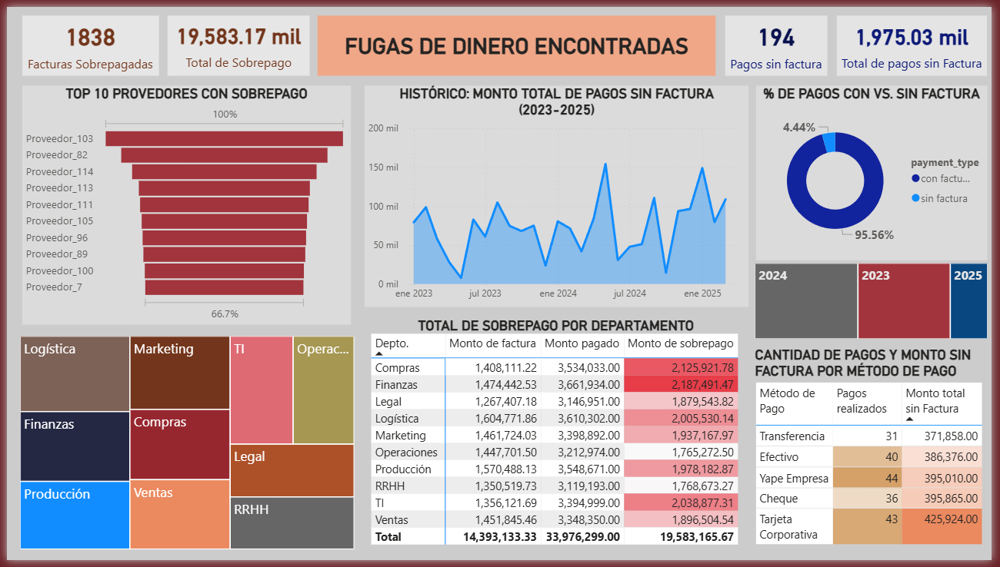
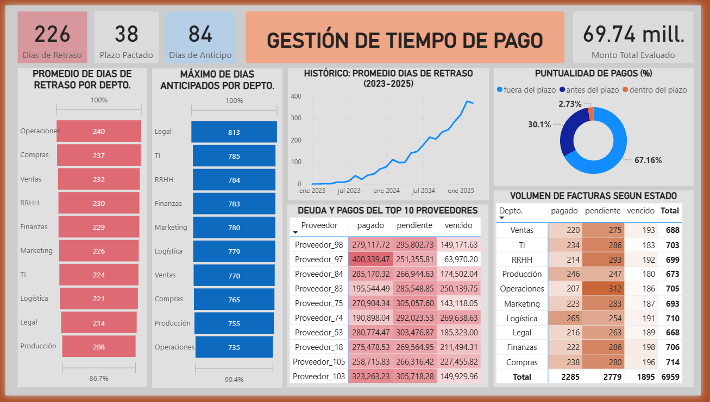
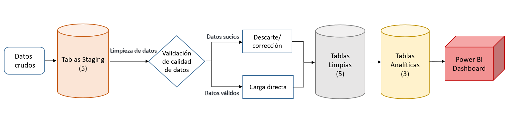

# Análisis y control de gastos por Departamentos
 

Proyecto diseñado de extremo a extremo (end to end) analiza el flujo de pagos y facturación de una mediana empresa para detectar irregularidades y pérdidas financieras. A través de un modelado de datos bajo la **Arquitectura Medallion**, se transformaron datos crudos en información estratégica para el control de sobrepagos por departamento, optimizar la gestión de plazos de vencimiento y el seguimiento de facturas pendientes.

## Arquitectura del Proyecto
Se implementó un flujo de datos estructurado:
- **Bronze (Ingestión):** Carga cruda de 5 tablas (bz_invoices, bz_payments, bz_suppliers, bz_method_payments, bz_departments).
- **Silver (Limpieza/Transformación):** Estandarización de tipos de datos, eliminación de duplicados y gestión de valores nulos.
- **Gold (Análisis):** Tablas de negocio específicas: `unassociated_payments`, `overpayment_invoices` e `invoice_time_management`.

## Hallazgos Principales (Insights)
- **Fugas de Dinero:** Identificación de 1,838 facturas sobrepagadas, representando un impacto significativo en el flujo de caja.
- **Gestión de Tiempo:** Análisis de retrasos donde departamentos como *Operaciones* presentan un promedio de 240 días de retraso, contrastado con una tendencia al alza en los tiempos de respuesta.

## Tecnologías Utilizadas
- **SQL:** Para todo el proceso de transformación y modelado (ETL).
- **Power BI:** Visualización de dashboards para la toma de decisiones.

*Para ver el análisis detallado, las queries clave y los dashboards, revisa el [Informe_Analisis.md](docs/Analisis_de_datos.md).*

